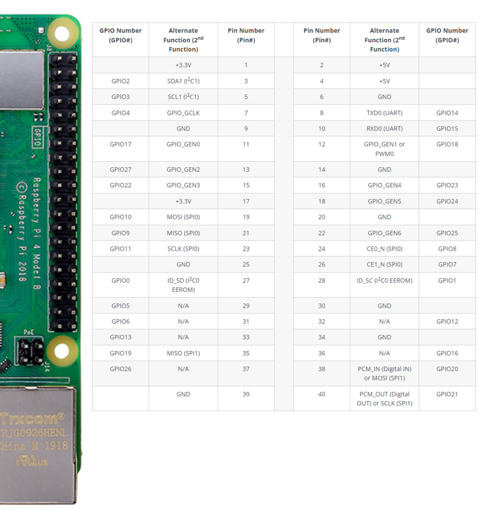

# py_robot

py_servo, py_sensorを応用して、センサーの値でサーボを動かす

||||
|--|--|--|
|status_publisher|status_topic(Bool)|GPIO18(12)の値を1sec毎でRead、ONならTrue、OFFならFalseをpublish|
|robot_manager|status_topic(Bool)|センサーON/OFFをsubscribeする|
|robot_manager|pwm_topic(Int16)|pwm_topicに対してパルス値をpublish(+100/sec)|
|pwm_subscriber|pwm_topic|パルス値を取得してpigpioでパルスを生成|

SG90などのマイクロサーボに負荷を掛けないのであればVDD,GND,PWM(GPIO)にサーボモーターを接続すると動作するはず

|RaspberryPi|SG90|
|--|--|
|5V|Vcc(Red)|
|GND|GND(Brown)|
|GPIO22(15)|PWM(Orange)|

|RaspberryPi|センサー|
|--|--|
|GPIO18(12)|配線片側1|
|3.3V|ON(配線片側2)|
|GND|OFF(配線片側2)|


```bash
ros2 pkg create --build-type ament_python py_robot
colcon build --packages-select py_robot
cd raspi_ws
. install/setup.bash
ros2 run py_robot robot_manager
ros2 run py_robot status_publisher
ros2 run py_robot pwm_subscriber
```


